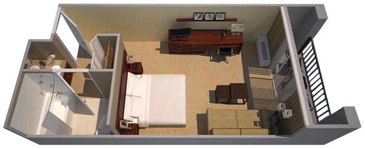
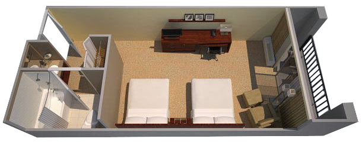

## Was

Wir haben einen Zimmerblock im Courtyard Marriott Chicago Highland Park/Northbrook Hotel für das Hochzeitswochenende (Nächte vom Donnerstag 8.9. bis Samstag 10.9.) unter dem Namen "Williams/Lohse Wedding Room Block" vorgemerkt.

## Warum

Das Hotel is sehr günstig gelegen um zum Traugottesdienst, zur Hochzeitsfeier, und zu den Wochenendaktivitäten zu gelangen. Wir raten euch daher sehr am Wochenende im Hotel zu übernachten, wenn ihr eine Übernachtungsmöglichkeit braucht. Am Tag der Hochzeit organisieren wir einen Bus zur Kirche und von der Kirche zur Feier. Die After-Party wird im Hotel stattfinden und der Botanische Garten und das Ravinia Festival liegen einen Spaziergang vom Hotel entfernt und werden vom Hotel Shuttle Service angefahren.

## Wo

Die Addresse des Hotels lautet [1505 Lake Cook Road, Highland Park, IL 60035](https://www.google.com/maps/place/Courtyard+Chicago+Highland+Park%2FNorthbrook). Beachtet unbedingt, dass es ein weiteres Marriott Courtyard Hotel in derselben Straße gibt, das richtige Hotel trägt den Namen "Courtyard Marriott Chicago Highland Park/Northbrook".

Vom Hotel aus kann man die Innenstadt von Chicago in ca. 1 Stunde erreichen (10 Minuten mit dem Hotel Shuttle zum Bahnhof und 50 Minuten mit der Metra Bahn bis zum Ogilvie Transportation Center). Vom O'Hare Flughafen ist es ca. 25 Minuten mit dem Taxi zum Hotel. Die Hochzeitsaktivitäten sind alle gut zu erreichen vom Hotel.

## Wie

Zimmer können per Telephon unter +1 866-381-4803 reserviert werden, vergesst nicht anzugeben, dass ihr ein Zimmer im Williams-Lohse Wedding Room Block buchen möchtet. Ihr könnt aber ebenso Zimmer online buchen, indem ihr [diesem Link folgt](http://www.marriott.com/meeting-event-hotels/group-corporate-travel/groupCorp.mi?resLinkData=Williams/Lohse%20Wedding%20Group%20Room%20Block%5Echihp%60wlwwlwa%7Cwlwwlwb%60109.00%60USD%60false%604%609/8/16%609/11/16%6008/18/2016&app=resvlink&stop_mobi=yes). Reservierunge müssen bis zum Donnerstag den 18.8. getätugt werden.

Es gibt zwei verschiedene Arten von Zimmern um Hotelblock:

Zimmer mit einem riesiegen Doppelbett ("king-sized bed") und einem Schlafsofa für maximal 3 Erwachsene (oder 2 Erwachsene und 2 Kinder).

Zimmer mit zwei normalen Doppelbetten ("queen-sized beds") für maximal 4 Erwachsene (und 1 Krippe).

Beide Zimmertypen kosten 121$ pro Nacht inklusive Steuern. (Bei voller Belegung mit 4 Leuten ergibt das einen Preis von nur 30$ / 27€ pro Person und Nacht.)

Falls du / ihr andere Leute sucht um ein Zimmer zu teilen, kontaktiert bitte Lauren ([maidofhonor@tobanika.us](mailto:maidofhonor@tobanika.us)), die euch helfen wird Mitbewohner zu finden.

## Getting Around

The hotel offers a free shuttle to hotel guests within a 5-mile (8-km) radius, which includes the [Braeside](http://metrarail.com/content/metra/en/home/maps_schedules/metra_system_map/up-n/map.html) or [Lake Cook Road](http://metrarail.com/content/metra/en/home/maps_schedules/metra_system_map/md-n/map.html) Metra train stations (ideal for reaching downtown Chicago) and the Chicago Botanic Garden and Ravinia Park (Wedding Weekend Program events for Saturday).

We will be hiring a shuttle for hotel guests without access to a car for the day of the wedding.  It will take guests from the hotel to Libertyville Covenant Church for the ceremony, then to the Kenilworth Club for the reception, and back to the hotel in the evening.  Please indicate on your RSVP card if you will be needing this service.  We will inform you of an exact shuttle schedule when you check in to the hotel.

## Getting to the Hotel

If you are coming directly to the hotel from O’Hare Airport, the hotel manager has given us some helpful information regarding taxis from the airport to the hotel:  

When you arrive at the airport and after you have collected your bags, you can call [American Taxi](https://www.americantaxi.com/ATOnlineOrderWeb/main.htm) (+1 847-255-9600) who will give you the taxi number to look for and instructions on where to pick it up. Additionally, there are 30+ phones marked "American Taxi" in the baggage claim areas at O'Hare. You can ask at the airport when you pick up your bags where to find one of these so you can order a taxi if you don't have a working cell phone.

American Taxi has a flat fee from the airport to the Courtyard Marriott hotel of about $34 dollars for a regular taxi (vans are about $10 more).   This is important to note because there is a difference between Chicago city taxis and Chicago suburban taxis.  American Taxi is a suburban taxi service, while city taxis include a huge surcharge to deliver to suburban addresses (ending up at $80 for the same trip to the hotel).  The first taxi you see at the airport, picking up passengers at the curb, is probably a city taxi so it is best to order a taxi ahead of time via phone.

Here are the pickup locations of American Taxi at each terminal for O'Hare Airport:

- Terminal 1: Pick Up Door G on baggage claim level, middle lane of traffic.
- Terminal 2: Pick Up Door E on baggage claim level, middle lane of traffic.
- Terminal 3: Pick Up Door G on baggage claim level, middle lane of traffic.
- Terminal 5 - International Terminal: Pick Up Door E on baggage claim level, first lane of traffic.

For airline/terminal information, check [here](http://www.flychicago.com/OHare/EN/MyFlight/Airline/Airline-Information).

## Accommodation for Chicago Vacation

Note that this hotel, and most of the Wedding Weekend Program events, are in the Chicago Suburbs. If you are planning a vacation to see Chicago in the days before or after the wedding weekend, this hotel might not be ideal for staying longer than the weekend because it is not in the city. Visit the [Travel](../travel) page for more information and suggestions on this topic.
