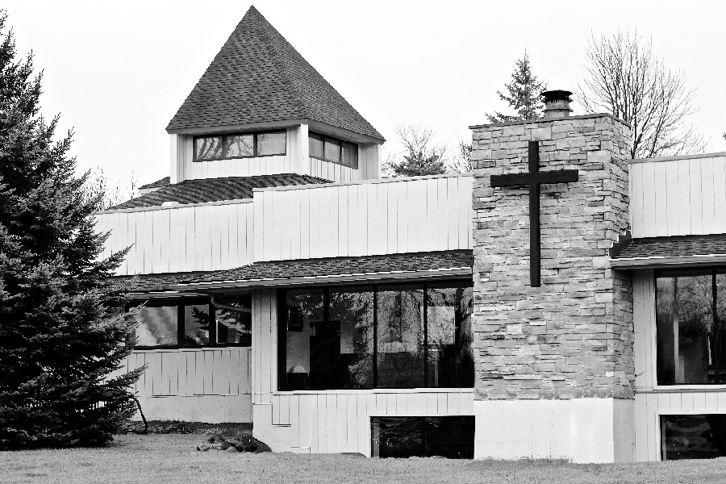
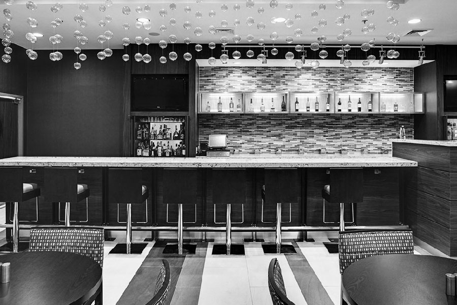
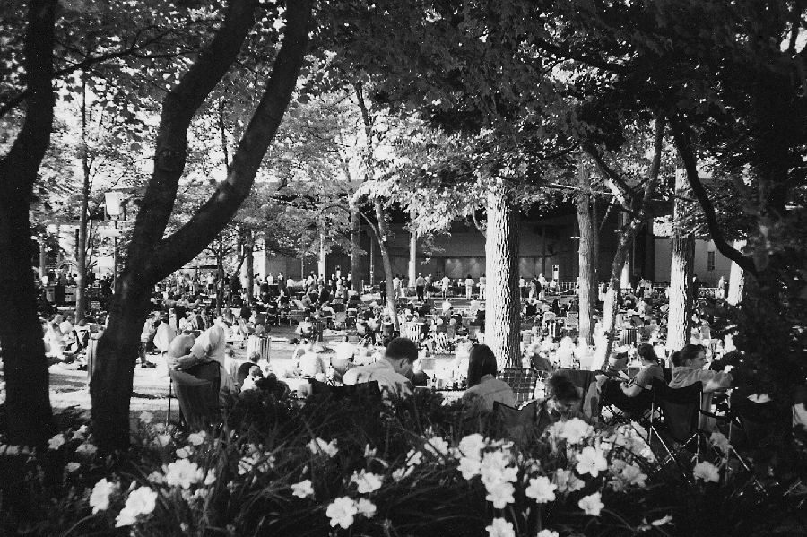
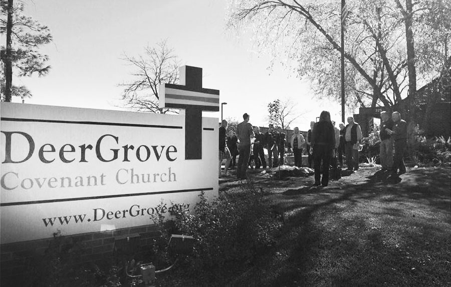
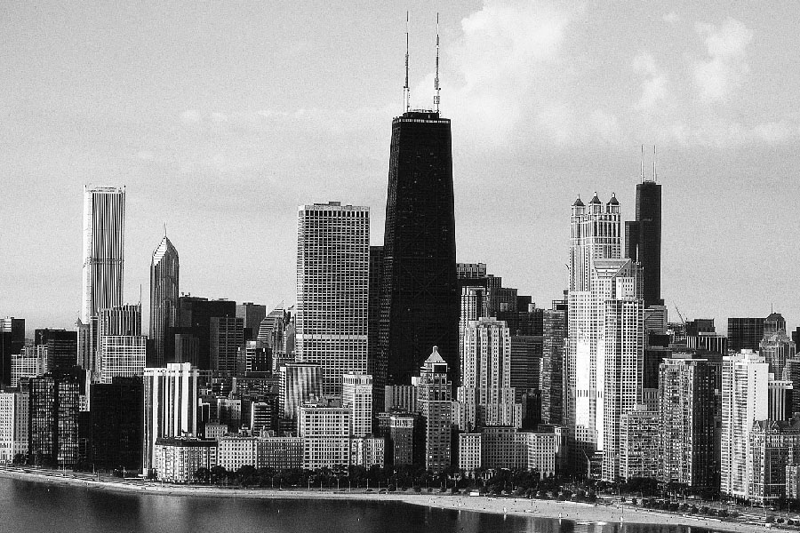
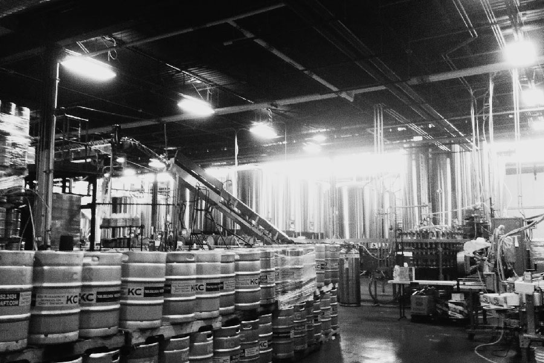
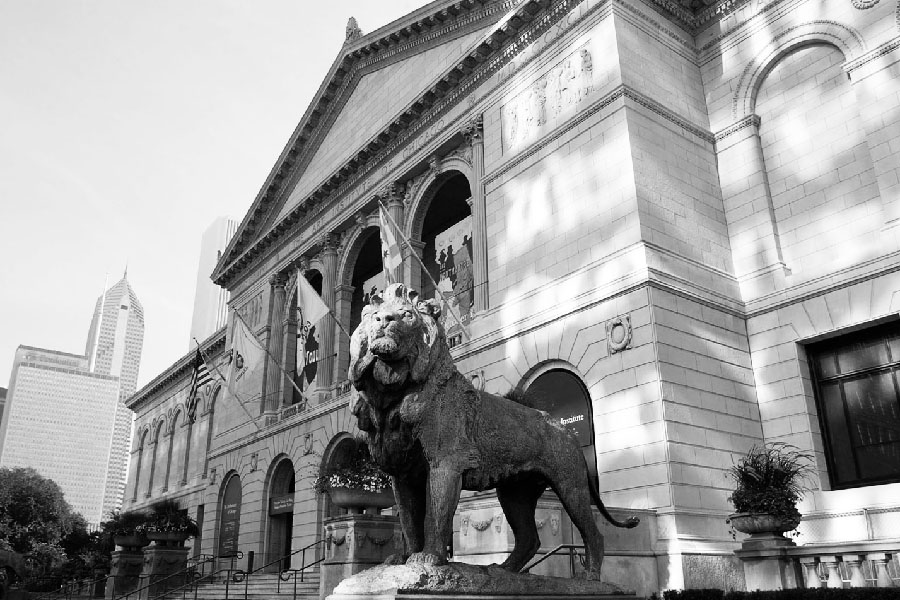
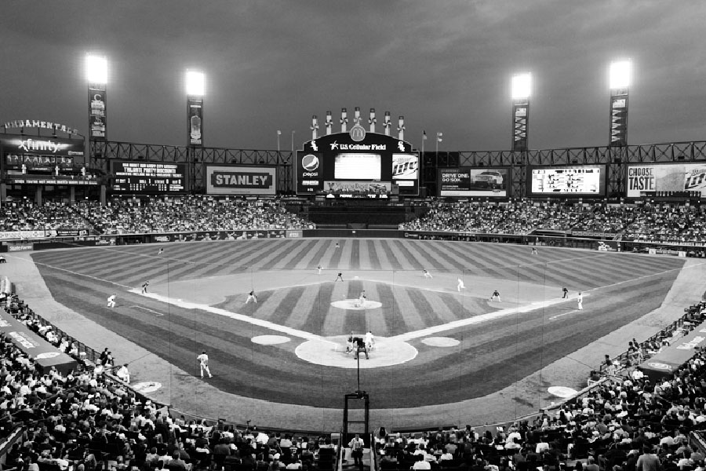

-------------------------------------------------------------------------------

**Freitag**

- [15:00 | Traugottesdienst](#ceremony)
- [18:00 | Hochzeitsfeier](#reception)
- [Mitternacht | After-Party](#after-party)

**Samstag**

- [nachmittags | Botanischer Garten](#botanic)
- [17:30 | Picknick und Open Air Konzert](#ravinia)

**Sonntag**

- [10:30 | Gottesdienst](#church)
- [15:00 | Chicago Stadtführung](#citytour)
- [19:00 | Besuch einer lokalen Brauerei](#brewery)

**Montag**

- [nachmittags | Besuch Kunstausstellung](#art)
- [19:00 | 'White Sox' Baseball Spiel](#baseball)

-------------------------------------------------------------------------------

## Freitag - 9.9.

15:00 Uhr
### Traugottesdienst

Libertyville Covenant Church  
[250 S St. Mary's Rd, Libertyville, IL 60048](https://www.google.com/maps/place/Libertyville+Covenant+Church)

Vor Gott, unseren Freunden und unseren Familien wollen wir unsere Entscheidung bekräftigen: Wir wollen gemeinsam durchs Leben gehen und uns gegenseitig bestärken, unseren Beitrag in dieser Welt zu leisten. Danke, dass ihr uns begleitet, jetzt und auf unserem zukünftigen Weg. Der Traugottesdienst wird von einer deutschen und einer amerikanische Pastorin geleitet. Beide sind gute Freunde von uns. Bitte bleibt nach dem Gottesdienst für ein Gruppenfoto vor der Kirche zusammen.

-------------------------------------------------------------------------------

18:00 Uhr
### Hochzeitsfeier

Kenilworth Club  
[410 Kenilworth Ave, Kenilworth, IL 60043](https://www.google.com/maps/place/The+Kenilworth+Club)

Begleitet uns nach der Trauung zum Kenilworth Club, wo wir unsere Hochzeit feiern. Zunächst wird es ein köstliches vegetarisches Festessen geben und den Hochzeitskuchen. Danach freuen wir uns über eure Beiträge zum Programm: witzige Spiele und kulturelle Darbietungen jeglicher Art mit Bezug zum Brautpaar sind willkommen. Wir zählen auf eure Kreativität! Jannis übernimmt die Programmkoordination; bitte nehmt Kontakt zu Jannis auf ([bestman@tobanika.us](mailto:bestman@tobanika.us)). Und zum Feiern gehört natürlich auch das Tanzen.

-------------------------------------------------------------------------------

Mitternacht
### Hochzeits After-Party

Bar des Courtyard Marriott Chicago Highland Park/Northbrook Hotel  
[1505 Lake Cook Rd, Highland Park, IL 60035](https://www.google.com/maps/place/Courtyard+Chicago+Highland+Park%2FNorthbrook)

Die Hochzeitsfeier endet nach amerikanischer Gepflogenheit um Mitternacht. Für alle mit andauernder Feierlaune haben wir die Hotel Bar reserviert, in der wir das Fest bei dem einen oder anderen Cocktail ausklingen lassen können.

-------------------------------------------------------------------------------

## Samstag - 10.9.

12:00 – 17:00  Uhr
### Botanischer Garten von Chicago

Chicago Botanic Gardens  
[1000 Lake Cook Rd, Glencoe, IL 60022](https://www.google.com/maps/place/Chicago+Botanic+Gardens)

Erfreut euch am Tag nach der Hochzeitsfeier bei einem entspannten Spaziergang durch den Botanischen Garten. Jeder kann kommen, wann er will oder sich individuell verabreden. Der Eintritt ist frei (es werden lediglich Parkgebühren erhoben). Falls ihr im Hotel übernachtet, gelangt ihr auch mit dem kostenlosen Shuttleservice zum Botanischen Garten.

-------------------------------------------------------------------------------

17:30 Uhr
### The Wizard of Oz mit Orchester

Ravinia Festival  
[418 Sheridan Rd, Highland Park, IL 60035](https://www.google.com/maps/place/Ravinia+Festival)

Open Air Konzerte inklusive Picknick sind ein besonderes Highlight des Sommers in Chicago. Das [Ravinia Festival](https://www.ravinia.org) veranstaltet jedes Wochenende Konzerte im Park. Das Orchester sitzt in einem Pavillon, der weiträumig von Wiesen umgeben ist. Hier kann man vor und während des Konzerts picknicken und sich entspannen.

Am Samstagabend wird der Film-Klassiker [The Wizard of Oz](https://en.wikipedia.org/wiki/The_Wizard_of_Oz_(1939_film)) aus dem Jahre 1939 auf großer Leinwand gezeigt, das [Chicago Philharmonic](http://www.chicagophilharmonic.org) Orchester spielt den bekannten Soundtrack live dazu! Bringt Essen und Trinken zum gemeinsamen Picknick um 17:30 Uhr mit und genießt das Film-Konzert um 19:00 Uhr zusammen mit uns.

Karten kosten 30$ inklusive Klappstuhl, 15$ für Schüler und Studenten (mit gültigem Schüler-/Studentenausweis), der Eintritt für Kinder unter 15 ist frei. Wenn wir ein Ticket für euch vorbestellen sollen, gebt dies bitte auf der RSVP Karte an oder schreibt uns direkt eine Email ([us@tobanika.us](mailto:us@tobanika.us)). Es gibt ggf. auch noch Karten an der Abendkasse für 8$ (+5$ für einen Klappstuhl), wenn ihr euch nicht vorher festlegen wollt. Hotelgäste können wiederum den kostenlose Shuttleservice in Anspruch nehmen, um zum Ravinia Festival zu gelangen.

-------------------------------------------------------------------------------

## Sonntag - 11.9.

10:30 Uhr
### Gottesdienst

DeerGrove Covenant Church  
[225 E Helen Rd, Palatine, IL 60067](https://www.google.com/maps/place/Deer+Grove+Covenant+Church)

Alle sind herzlich zum Sonntagsgottesdienst in der [DeerGrove Covenant](http://deergrove.org) Church — der Heimatkirche der Braut — eingeladen. Die moderne [Evangelical Covenant Church](http://www.covchurch.org/) ist eine Kirche in der lutherischen Tradition.

-------------------------------------------------------------------------------

15:00 Uhr
### Chicago Stadtführung

Treffpunkt wird bekannt gegeben.

Erkunde die bewegte Geschichte und atemberaubende Architektur der 'Windy City' auf einer Stadttour mit uns. Weitere Details folgen in Kürze.

-------------------------------------------------------------------------------

19:00 Uhr
### Brauereitour und Verkostung

Treffpunkt wird bekannt gegeben.

Lasst die Stadtführung mit dem Besuch einer Brauerei ausklingen, in die euch der Bruder der Braut - ein ausgewiesener Bierkenner - führen wird. Chicago hat seit einigen Jahren eine sehr lebendige Szene von zahlreichen kleinen lokalen Brauereien — sogenannten [craft breweries](http://www.timeout.com/chicago/bars/chicagos-craft-beer-scene) — welche sehr innovativ sind und dem Vergleich zu deutschem Bier ohne Abstriche standhalten. Bei der Führung kannst du etwas über die verschiedenen alten und neuen Biersorten lernen, welche sich einer wachsenden Popularität in den USA erfreuen. Weitere Details folgen in Kürze. Bitte beachtet, dass die Verkostung von Bier in den USA erst ab dem 21. Lebensjahr erlaubt ist.

-------------------------------------------------------------------------------

## Montag - 12.9.

11:00 – 17:00  Uhr
### Besuch im Art Institute

Art Institute von Chicago  
[111 S Michigan Ave, Chicago, IL 60603](https://www.google.com/maps/place/The+Art+Institute+of+Chicago)

Besucht Chicagos berühmtestes (und Tobias liebstes) Museum mit uns: das [Art Institute](http://www.artic.edu). Unter dem Schutz der majestätischen Bronzelöwen gibt es neben vielem anderen herausragende im- und expressionistische Gemälde, die Chagall Fenster und natürlich Edward Hopper's [Nighthawks](http://wikiwand.com/en/Nighthawks) zu bestaunen. Nicht versäumen sollte man auch die Sammlung von Miniatur-Puppenhäusern (Klein-Anikas Lieblingsausstellung).

-------------------------------------------------------------------------------

7:00 PM
### White Sox Baseball Spiel

US Cellular Field  
[333 W 35th St, Chicago, IL 60616](https://www.google.com/maps/place/U.S.+Cellular+Field)

Macht eine echt amerikanische Erfahrung und begleitet uns zu einem Baseball Spiel! Das Lieblingsteam der Braut, die [Chicago White Sox](http://chicago.whitesox.mlb.com) werden die Cleveland Indians mit Sicherheit vernichtend schlagen. Wir erklären euch die Spielregeln und macht euch keine Sorgen, ihr müsst nicht die ganze Zeit stehen und grölen. Baseball ist ein Sport mit vielen Pausen und lädt zu gemütlichen Gesprächen, zum Biertrinken und zu HotDog oder Brezel essen ein. Wichtig ist der Dresscode: *schwarz* und *weiß* und auf gar keinen Fall rot!
