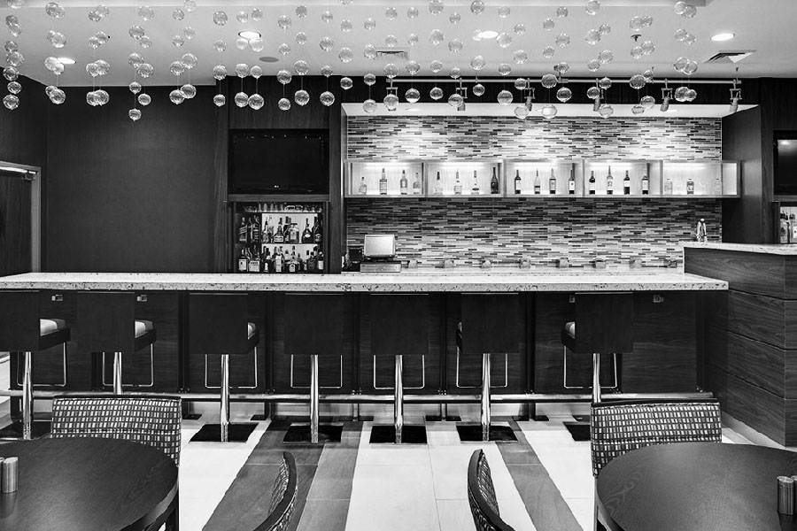
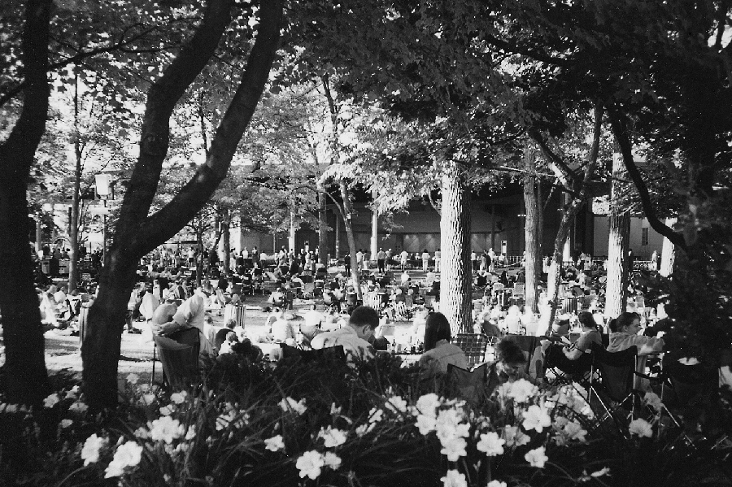
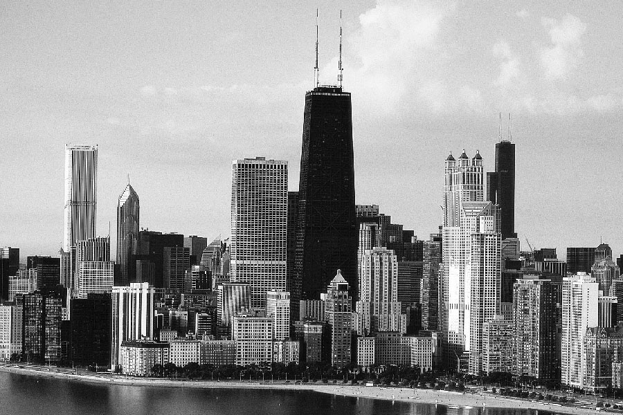
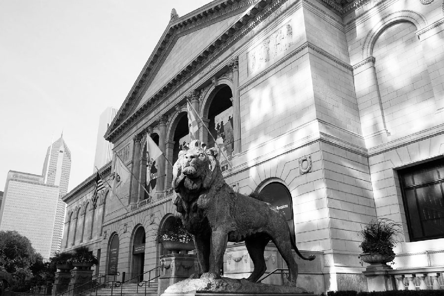

## Fri : Sept 9

3:00 PM
### Wedding Ceremony

Libertyville Covenant Church  
[250 South St. Mary's Road, Libertyville, IL 60048](https://www.google.com/maps/place/Libertyville+Covenant+Church)

We want to get married in front of our friends and family as a witness to the role you all have played, and continue to play, in our lives.  We will be married by two pastors, one German and one American, who have played important roles in each of our lives.  Please come witness this marriage and then join us for a large group photo

-------------------------------------------------------------------------------

6:00 PM
### Wedding Reception

Kenilworth Club  
[410 Kenilworth Ave, Kenilworth, IL 60043](https://www.google.com/maps/place/The+Kenilworth+Club)

Dinner, dancing, and games.

-------------------------------------------------------------------------------

midnight
### Reception After-Party

Bar of Courtyard Marriott Chicago Highland Park/Northbrook  
[1505 Lake Cook Rd, Highland Park, IL 60035](https://www.google.com/maps/place/Courtyard+Chicago+Highland+Park%2FNorthbrook)

All are welcome to join!

-------------------------------------------------------------------------------

## Sat : Sept 10

9:00 AM – 4:00 PM
### Chicago Botanic Garden

Chicago Botanic Gardens  
[1000 Lake Cook Rd, Glencoe, IL 60022](https://www.google.com/maps/place/Chicago+Botanic+Gardens)

Enjoy a morning or early afternoon of strolling through the lovely Botanic Gardens of Chicago.  Free admission, you just have to pay for parking.  If you are staying at the hotel, you can arrange for the hotel’s free shuttle to bring you!

-------------------------------------------------------------------------------

7:00 PM
### The Wizard of Oz with Orchestra

Ravinia Festival  
[418 Sheridan Rd, Highland Park, IL 60035](https://www.google.com/maps/place/Ravinia+Festival)

The 1939 American classic The Wizard of Oz will be shown on big screens through the park, while the Chicago Philharmonic plays the soundtrack live!  Tickets are limited, so please indicate on your RSVP card if you would like a ticket for this event.  First come, first served.

Tickets are $30, which includes entry and a rental chair and table.  The cost is $15 for students (including university students, valid only with student ID which indicates an expiration date).  Children under 15 are free.  

Please bring food and drink, as we will be picnicking together before the show begins.  Join us at 5:30pm to hang out and dine before the show starts at 7pm.

-------------------------------------------------------------------------------

## Sun : Sept 11

### Church Service

-------------------------------------------------------------------------------

### City Tour

-------------------------------------------------------------------------------

### Brewery Tour

-------------------------------------------------------------------------------

## Mon : Sept 12

10:00 AM
### Art Institute Visit

-------------------------------------------------------------------------------

7:10 PM
### White Sox vs. Indians Baseball Game

US Cellular Field

Join us for a classic ballgame between Anika’s favorite team, the Chicago White Sox, and the Cleveland Indians.  If you don’t know much about baseball, this is your chance to have a great American experience and learn how the game is played.  Baseball games are a great background for socializing, drinking beer, and eating hotdogs.  No need to worry about standing and cheering for several hours.  Be sure to wear black and white!  And absolutely no red!
