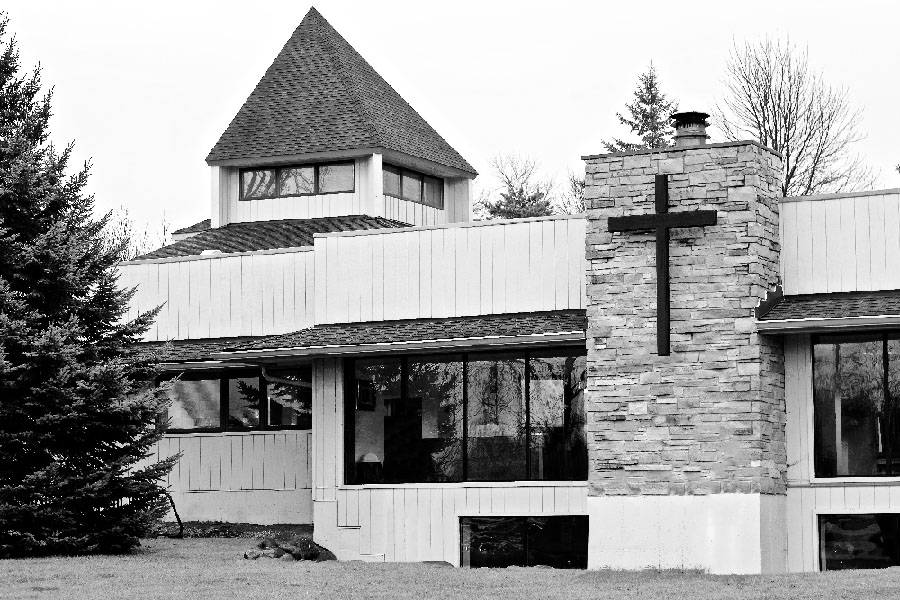
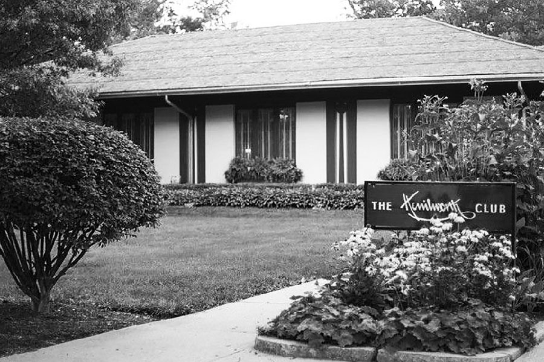
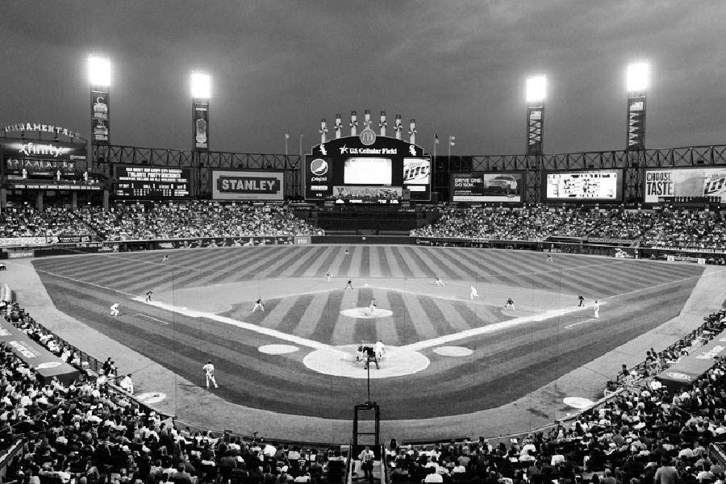

-------------------------------------------------------------------------------

**Friday**

- [3:00 PM | Wedding Ceremony](#ceremony)
- [6:00 PM | Wedding Reception](#reception)
- [midnight | Reception After-Party](#after-party)

**Saturday**

- [afternoon | Chicago Botanic Garden Visit](#botanic)
- [5:30 PM | Picnic and Movie in the Park](#ravinia)

**Sunday**

- [10:30 AM | Church Service at DeerGrove](#church)
- [3:00 PM | Chicago City Tour](#citytour)
- [7:00 PM | Craft Brewery Tour and Tasting](#brewery)

**Monday**

- [afternoon | Visit the Art Institute](#art)
- [7:00 PM | White Sox Baseball Game](#baseball)

-------------------------------------------------------------------------------

## Fri : Sept 9

3:00 PM
### Wedding Ceremony

Libertyville Covenant Church  
[250 S St. Mary's Rd, Libertyville, IL 60048](https://www.google.com/maps/place/Libertyville+Covenant+Church)

We want to get married in front of our friends and family as a witness to the role you all have played, and continue to play, in our lives.  We will be married by two pastors, one German and one American, who have been important to each of us.  Please come witness our marriage and then join us for a large group photo afterwards in front of the church.

-------------------------------------------------------------------------------

6:00 PM
### Wedding Reception

Kenilworth Club  
[410 Kenilworth Ave, Kenilworth, IL 60043](https://www.google.com/maps/place/The+Kenilworth+Club)

Join us in celebrating our marriage as we enjoy a delicious vegetarian dinner together, which will leave you feeling full and not guilty. Dinner will be followed by dancing and the German tradition of games and performances by guests. In this tradition, guests plan games to play, involving audience members or just the Bride and Groom.  Little performances — such as funny songs, skits, or stories — are also welcome. Please contact Jannis ([bestman@tobanika.us](mailto:bestman@tobanika.us)) if you would like to help plan a game or performance during the reception party.

-------------------------------------------------------------------------------

midnight
### Reception After-Party

Bar of Courtyard Marriott Chicago Highland Park/Northbrook Hotel  
[1505 Lake Cook Rd, Highland Park, IL 60035](https://www.google.com/maps/place/Courtyard+Chicago+Highland+Park%2FNorthbrook)

German wedding receptions have a tendency to go until 5 in the morning. In honor of this, we will continue the party — on a more chill level — at the hotel lobby after the reception hall closes down at midnight. All are welcome to join!

-------------------------------------------------------------------------------

## Sat : Sept 10

12:00 PM – 5:00 PM
### Chicago Botanic Garden

Chicago Botanic Gardens  
[1000 Lake Cook Rd, Glencoe, IL 60022](https://www.google.com/maps/place/Chicago+Botanic+Gardens)

Enjoy an early afternoon of strolling through the lovely Botanic Gardens of Chicago.  This is a less organized event, and more a suggestion for a lazy Saturday morning to recover from the party the night before. Admission is free, you just have to pay for parking.  If you are staying at the hotel, you can arrange for the hotel’s free shuttle to bring you!

-------------------------------------------------------------------------------

5:30 PM
### The Wizard of Oz with Orchestra

Ravinia Festival  
[418 Sheridan Rd, Highland Park, IL 60035](https://www.google.com/maps/place/Ravinia+Festival)

[Ravinia Festival](https://www.ravinia.org) is a staple of the Chicago North Suburbs, where locals gather every weekend evening during the summer for outdoor concerts and films. The park has a pavilion with set seating and a large open lawn for picnicking and relaxing during the performance.

The 1939 American classic [The Wizard of Oz](https://en.wikipedia.org/wiki/The_Wizard_of_Oz_(1939_film)) will be shown on big screens throughout the park, while the [Chicago Philharmonic](http://www.chicagophilharmonic.org) plays the soundtrack live! Please bring food and drink, as we will be picnicking together before the show begins.  Join us at 5:30 PM to hang out and dine before the show starts at 7:00 PM.

Tickets are $30, which includes entry and a rental chair and table.  The cost is $15 for students (including university and PhD students, valid only with student ID which indicates an expiration date).  Children under 15 are free. Tickets are limited, so please indicate on your RSVP card or by email ([us@tobanika.us](mailto:us@tobanika.us)) if you would like a ticket for this event.  First come, first served.

-------------------------------------------------------------------------------

## Sun : Sept 11

10:30 AM
### Church Service

DeerGrove Covenant Church  
[225 E Helen Rd, Palatine, IL 60067](https://www.google.com/maps/place/Deer+Grove+Covenant+Church)

Join us for morning worship service at [the Bride's home church](http://deergrove.org), in the tradition of the contemporary [Evangelical Covenant](http://www.covchurch.org/).

-------------------------------------------------------------------------------

3:00 PM
### Chicago City Tour

Meeting location to be announced.

Experience the breathtaking architecture and colorful history of the Windy City with us on a walking tour. More details to follow.

-------------------------------------------------------------------------------

7:00 PM
### Craft Brewery Tour

Location to be announced.

End the city tour with a visit to a local [Chicago craft brewery](http://www.timeout.com/chicago/bars/chicagos-craft-beer-scene), with a guided tour and tasting.  Learn about the different styles of beer that have become famous in the US in the past few years from the Bride's beer connoisseur brother, and enjoy some delicious cold brew. Even the German Groom is impressed by the selection and creativity of the modern brews of the American craft brewery scene. More details to follow.  Please keep in mind that this is a 21+ event.

-------------------------------------------------------------------------------

## Mon : Sept 12

11:00 AM – 5:00 PM
### Art Institute Visit

Art Institute of Chicago  
[111 S Michigan Ave, Chicago, IL 60603](https://www.google.com/maps/place/The+Art+Institute+of+Chicago)

We would love for you to join us in visiting Chicago's most famous (and the Groom's favorite) museum, the [Art Institute](http://www.artic.edu). Walk past the famous bronze lions and enter a great museum with some amazing art, including the Chagall window, Impressionist and Expressionist paintings, Edward Hopper's [Nighthawks](http://wikiwand.com/en/Nighthawks), and some miniature dollhouse rooms (little Anika's favorite exhibit).

-------------------------------------------------------------------------------

7:00 PM
### White Sox Baseball Game

US Cellular Field  
[333 W 35th St, Chicago, IL 60616](https://www.google.com/maps/place/U.S.+Cellular+Field)

Join us for a classic ballgame between the Bride’s favorite team, the [Chicago White Sox](http://chicago.whitesox.mlb.com), and the Cleveland Indians.  If you don’t know much about baseball, this is your chance to have a great American experience and learn how the game is played.  Baseball games are a great background for socializing, drinking beer, and eating hotdogs.  No need to worry about standing and cheering for several hours.  Be sure to wear black and white!  And absolutely no red!
