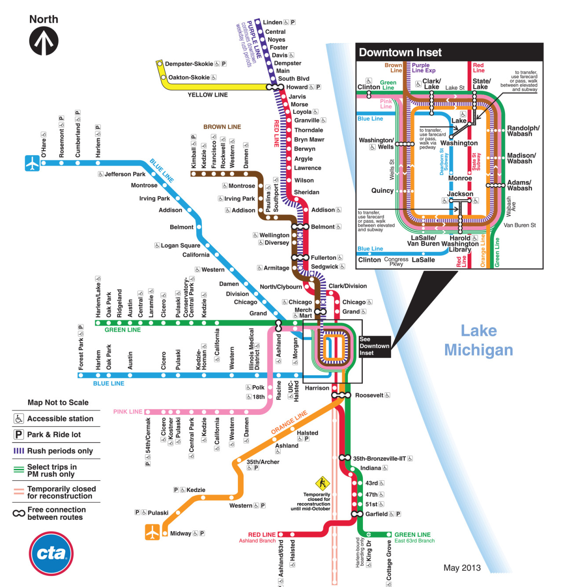

Check out the [list](http://vacation.for.tobanika.us) we made of our favorite activities in and around Chicago for planning your trip.  We also included a couple other suggestions for traveling in the US if you have more planning to do!

## Using Public Transit in Chicago

**The L and City Buses**

[The L](http://www.transitchicago.com/riding_cta/how_to_guides/ridingthetrain.aspx) is Chicago's elevated (L-evated) train system which connects you to everything around the city (including the [Art Institute](../program?lang=en#art) and [US Cellular Field](../program?lang=en#baseball) for wedding weekend events).  There are also [city buses](http://www.transitchicago.com/riding_cta/how_to_guides/ridingthebus.aspx) which take you everywhere else in between, or in case you need a break from walking. There is also a [bus tracker](http://www.ctabustracker.com/bustime/home.jsp) for finding when the next bus will reach your station. Both the bus and L are run by the CTA (Chicago Transit Authority), and you can find a map of the bus and L routes [here](http://www.transitchicago.com/travel_information/maps/default.aspx?source_quicklinks=1).

You will need to get a [Ventra card](https://www.ventrachicago.com) for paying for public transportation in Chicago. The Ventra card costs $5.00 up front, but if you register the card online you get those $5.00 as credit to your account. The card is purchasable at most stations. Money can be added online once you register the card and make an account, or at the machine at the station. A one-way ride is $2.25 ($1.10 for children ages 7-11 or 11-17 with student ID, free for children under 7), and transfers are an extra $0.25 each. You can pay with exact change on the bus only, otherwise you need to use the Ventra card for bus or L travel. You can also get short-term, disposable passes at $3.00 one-way ($5 from O'Hare) or $10 for a day pass. Find more info about ticket fares [here](http://www.transitchicago.com/fares/).

**The Metra**

The [Metra](https://metrarail.com/metra/en/home.html) is Chicago's regional train system which connects the suburbs to the city center. The [hotel](../hotel?lang=en) recommended for the wedding weekend is close to two Metra stations, allowing you to get downtown from the hotel, or reach the hotel from the city when you arrive.

Metra tickets can be bought at the station if it is staffed. They are also available on the train with cash. But if tickets were purchasable at the station there is a surcharge of $3 if the ticket is bought on the train. There is a weekend pass available for $8 which is a good idea, unless you just go one way on the weekend. 

**Taxis**

Another immediate option for getting around in the city is to take a taxi. Here is a good article about [hailing a taxi](https://www.evernote.com/shard/s34/sh/47750197-96da-44b1-a3ac-a399877e7cdd/2adf3f84ec7d210f) in Chicago, because you can grab any taxi as it drives by, as long as it's empty. And don't forget to tip! Check out info about getting a taxi from O'Hare airport to the wedding weekend hotel [here](../hotel?lang=en#hoteltaxi).

## Accommodations for Chicago Vacation

Note that the Courtyard Marriott Hotel recommended for the wedding weekend, and most of the wedding weekend events, are in the Chicago Suburbs. If you are planning a vacation to see Chicago in the days before or after the wedding weekend, this hotel might not be ideal for staying longer than the weekend because it is not in the city. We recommend seeking out other hotels in the city or use [AirBnB](https://www.airbnb.com/s/Chicago--IL?s_tag=s-NqqC-U) to find someplace to stay closer to the city’s attractions if you are staying an extended length of time to see Chicago. That being said, you can reach the center of the city by [Metra train](https://metrarail.com/metra/en/home.html) from this hotel in an hour and for $6.25, so if you are just staying for a couple extra days, then maybe it is not worth to move to a different hotel.

We would recommend finding an AirBnB or hotel somewhere in the [Lincoln Park neighborhood](https://www.google.com/maps/place/Lincoln+Park,+Chicago,+IL,+USA), which gives access to the Metra for getting everywhere from downtown to the beautiful northern suburbs to the hip neighborhoods on the west side of town.

##  Special Things to Note

If you really feel inspired to learn about how to be American, check out [this article](https://www.tripadvisor.com/Travel-g191-c3541/United-States:Customs.Habits.And.Etiquette.html) for some great tips.  ;)

**Getting into the USA**

When traveling to the US as a non-citizen, you must have an [ESTA](https://esta.cbp.dhs.gov/esta/) (Electronic System for Travel Authorization) for participants of the [Visa Waiver Program](https://www.dhs.gov/visa-waiver-program). You will need an address of where you are staying (the hotel address for the wedding weekend is: [1505 Lake Cook Road, Highland Park, IL 60035](https://www.google.com/maps/place/Courtyard+Chicago+Highland+Park%2FNorthbrook)) and your passport to fill out the application. The process will take about 20 minutes and your travel authorization should be immediate (at the most, within 72 hours). The cost of the application is $14 ($4 processing fee, $10 authorization fee) and must be paid by credit or debit card (MasterCard, Visa, American Express, and Discover/JCB/Diners Club).

**Tipping**

A significant portion of a server's wages comes from tips in the US, so it is very important that you don't forget to include tip. The normal tip amount is 10% of the bill, up to 20% for great service. It is also normal to tip a bartender between $0.50 to $1 per drink. It is a common practice to leave the tip on the table or the bar if you are paying in cash.  If you are paying with card, you can include tip on the bill when you sign, or you can leave cash on the table or bar after paying.

**Sales Tax**

Unlike in Germany, tax is not already included in the price of an item.  Account for an additional 10% in sales tax at stores and restaurants to be added when paying the bill.

**Drinking Age**

You are not allowed to buy or drink alcohol (beer, wine, hard liquor) under the age of 21. Those under 21 are not even allowed in bars. You should also expect to be 'carded' (asked for your ID) when you order a drink at a bar or restaurant, so be sure to carry your government-issued ID or passport when going out.
